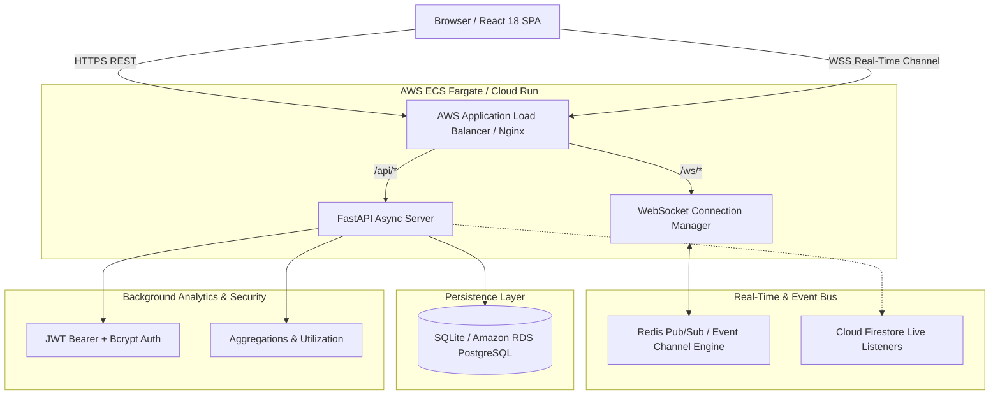
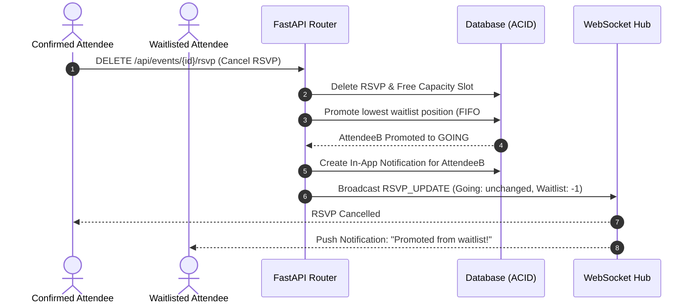

# Real-Time Cloud-Based Event Planning & RSVP Tracker

[](https://github.com)
[](https://www.python.org/)
[](https://fastapi.tiangolo.com/)
[](https://react.dev/)
[](https://www.docker.com/)
[](https://opensource.org/licenses/MIT)

> An enterprise-grade, distributed, cloud-native event planning and RSVP tracking platform featuring **concurrency-safe registrations**, **sub-15ms real-time WebSocket state synchronization**, **automated FIFO waitlist promotions**, and **zero overbooking guarantees**.

---

## 🌟 Key Features

- **⚡ Instant Real-Time WebSocket Updates**: Attendee counts, capacity meters, and organizer announcements sync dynamically across all active clients in sub-15ms without page refreshes.
- **🔒 Concurrency Control & Overbooking Prevention**: Database-level unique constraints (`uq_event_user_rsvp`) and serializable transactions guarantee that concurrent RSVP requests never exceed maximum venue limits.
- **📋 Automated FIFO Waitlist**: Overflow attendees are automatically placed on a prioritized waitlist; when an existing attendee cancels, the first person on the waitlist is promoted to confirmed status and notified instantly.
- **👑 Role-Based Access Control (RBAC)**: Fine-grained security separating **Attendees**, **Organizers**, and **Admins**. Organizers have exclusive control over editing, publishing, cancelling, and viewing waitlist queues.
- **📊 Real-Time Analytics Dashboard**: Real-time capacity utilization gauges, attendance probability estimations, and aggregate cross-event performance metrics.
- **☁️ Cloud & Production Ready**: Fully containerized with multi-stage `Dockerfile` and `docker-compose.yml`, Terraform Infrastructure-as-Code for AWS ECS/ALB/RDS, and GitHub Actions CI/CD pipeline.

---

## 🏗️ System Architecture



---

## 🔄 Concurrency & Waitlist Flow



---

## 🚀 Quick Start (Local Development)

### 1. Prerequisites
- Python 3.12+
- Node.js 18+ and npm
- Git

### 2. Backend Setup
```bash
# Clone the repository
git clone https://github.com/Prashanth-kulal/Cloud-Event-RSVP-Tracker.git
cd Cloud-Event-RSVP-Tracker

# Create and activate virtual environment
python -m venv venv
# On Windows PowerShell:
.\venv\Scripts\Activate.ps1
# On macOS/Linux:
source venv/bin/activate

# Install dependencies
pip install -r requirements.txt

# Seed realistic sample data
python sample_data/seed_data.py

# Start FastAPI backend server
uvicorn backend.app:app --host 0.0.0.0 --port 8000 --reload
```
The backend API is now running at `http://localhost:8000` with interactive Swagger docs at `http://localhost:8000/docs`.

### 3. Frontend Setup
```bash
cd frontend

# Install Node modules
npm install

# Start Vite React development server
npm run dev
```
The frontend is now accessible at `http://localhost:5173`.

---

## 🔑 Demo Seed Accounts

The database comes pre-seeded with realistic events, RSVPs, waitlist queues, and demo accounts:

| Role | Email | Password | Access Capabilities |
| :--- | :--- | :--- | :--- |
| **Organizer** | `sarah@cloudnative.io` | `Password123!` | Create, publish, cancel events, post announcements, inspect waitlists |
| **Organizer** | `alex@devops.org` | `Password123!` | Host hackathons, security masterclasses, and monitor analytics |
| **Attendee** | `elena@techflow.dev` | `Password123!` | Browse events, RSVP (Going/Maybe), view notifications |
| **Attendee** | `david@dataminds.ai` | `Password123!` | RSVP to workshops, manage attendance |
| **Attendee** | `marcus@cybersec.co` | `Password123!` | Waitlisted attendee for capacity demonstration |

> 💡 **Tip**: Use the **Quick Demo Sign-In** buttons on the Login page for one-click testing!

---

## 🧪 Automated Testing

A comprehensive automated test suite covers authentication, event management, cross-organizer security, and concurrency safety:

```bash
# Run pytest with verbose reporting
pytest tests/ -v
```

### Verified Test Cases:
- `test_register_new_user`: User registration and JWT token validation
- `test_duplicate_registration_fails`: 409 Conflict handling for duplicate emails
- `test_login_success` & `test_login_invalid_password`: Bcrypt credential authentication
- `test_get_current_user_profile`: Authenticated user profile retrieval
- `test_organizer_create_and_publish_event`: Full event lifecycle (Draft -> Published)
- `test_attendee_cannot_create_event`: 403 Forbidden RBAC validation
- `test_organizer_cannot_modify_others_event`: Cross-organizer authorization guard
- `test_rsvp_capacity_and_waitlist_flow`: Concurrency limit, overbooking block, waitlist overflow, and cancellation promotion
- `test_announcements_and_notifications_flow`: Real-time announcements and notification feeds

---

## 🐳 Docker Container Deployment

Deploy the entire stack with a single command:

```bash
docker-compose up --build
```

- **Frontend**: `http://localhost:3000`
- **Backend API**: `http://localhost:8000`
- **Interactive Swagger Docs**: `http://localhost:8000/docs`

---

## ☁️ Cloud Infrastructure (AWS / GCP / Terraform)

### Infrastructure as Code (Terraform)
Located in `cloud/terraform/main.tf`:
- **VPC & Subnets**: Multi-AZ network topology across availability zones.
- **Application Load Balancer (ALB)**: Session-sticky target groups with WebSocket connection upgrade support.
- **AWS ECS Fargate**: Serverless container execution with auto-scaling policies.
- **AWS RDS**: Scalable managed PostgreSQL with automated daily snapshots and multi-AZ failover.

To initialize and deploy via Terraform:
```bash
cd cloud/terraform
terraform init
terraform plan
terraform apply
```

---

## 📡 REST & WebSocket API Specification

### Authentication
- `POST /api/auth/register` — Create new account (ATTENDEE / ORGANIZER)
- `POST /api/auth/login` — Authenticate and receive JWT access token
- `GET /api/auth/me` — Retrieve current user profile

### Events
- `GET /api/events` — Query published events with search, category, and status filters
- `GET /api/events/{id}` — Fetch detailed event information with live RSVP counts
- `POST /api/events` — Create new event in DRAFT status (Organizer only)
- `PUT /api/events/{id}` — Update event parameters (Organizer only)
- `POST /api/events/{id}/publish` — Publish event to public catalog (Organizer only)
- `POST /api/events/{id}/cancel` — Cancel event and broadcast notification (Organizer only)
- `GET /api/events/organizer/my-events` — Retrieve all events created by logged-in organizer

### RSVPs & Waitlist
- `POST /api/events/{id}/rsvp` — Submit or update RSVP (`GOING`, `MAYBE`, `NOT_GOING`)
- `DELETE /api/events/{id}/rsvp` — Cancel RSVP and trigger automated waitlist promotion
- `GET /api/rsvps/me` — Retrieve all registrations for current attendee
- `GET /api/events/{id}/waitlist` — View ordered FIFO waitlist queue (Organizer only)

### Real-Time & Announcements
- `WS /ws/events/{id}` — Real-time bi-directional WebSocket connection for instant event state updates
- `POST /api/events/{id}/announcements` — Broadcast announcement to all attendees (Organizer only)
- `GET /api/events/{id}/announcements` — List event announcements
- `GET /api/notifications` — Fetch user in-app notifications
- `PUT /api/notifications/{id}/read` — Mark notification as read

---

## 📄 License
This project is open-source and distributed under the [MIT License](LICENSE).
