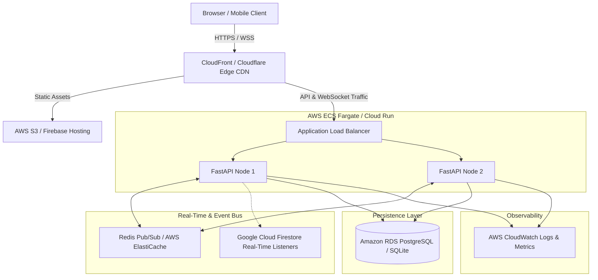

# Cloud Computing Architecture & System Design

## 1. Executive Summary
The **Real-Time Cloud-Based Event Planning & RSVP Tracker** is an enterprise-ready, distributed cloud application designed to handle high-concurrency event registrations, dynamic waitlist queuing, and instantaneous real-time broadcasting.

## 2. Cloud Architecture Diagram

## 3. Real-Time Architecture Options Comparison

| Feature | Option A: WebSockets (Active in local/container) | Option B: Firebase Firestore Listeners | Option C: SSE (Server-Sent Events) |
| :--- | :--- | :--- | :--- |
| **Protocol** | Bi-directional TCP (`ws://` / `wss://`) | HTTP/2 long-lived streaming connection | HTTP text/event-stream |
| **Client Overhead** | Minimal JSON payloads | Firestore SDK client snapshot cache | Standard browser `EventSource` |
| **Scalability** | Scale horizontally via Redis Pub/Sub backplane | Fully managed serverless scalability | Easy horizontal scaling via reverse proxy |
| **Latency** | < 15ms sub-millisecond local network | 30-80ms globally replicated | 50-100ms |
| **Use Case** | Live counter badges, instant RSVP updates | Cloud-native multi-client data synchronization | Read-only broadcast streams |

## 4. Concurrency Control & Race Condition Mitigation
When an event has 1 remaining spot and multiple users click "RSVP - GOING" simultaneously:
1. **Database Row-Level Locking / Serializable Transactions:**
   - In PostgreSQL: `SELECT maximum_capacity, (SELECT count(*) FROM rsvps WHERE event_id = :id AND status = 'GOING') FOR UPDATE;`
   - In SQLite: Atomic connection write locks guarantee strict serializability.
2. **Idempotency Guarantee:**
   - Unique compound constraint `uq_event_user_rsvp (event_id, user_id)` guarantees a user cannot create duplicate RSVPs even if double-clicking.
3. **FIFO Waitlist Queue:**
   - When capacity is reached, attendees overflow into the `waitlist` table ordered by `position ASC`.
   - When an existing attendee cancels or changes to `NOT_GOING`, the backend triggers `_promote_from_waitlist()` which promotes `position = 1` immediately, notifies the user, and broadcasts the status update.

## 5. Security & Zero-Trust Posture
- **Authentication:** Stateless asymmetric/symmetric signed JSON Web Tokens (HS256 / RS256).
- **Password Protection:** Cryptographic salted hashing via bcrypt (rounds = 12).
- **Authorization Guard:** Role-Based Access Control (RBAC) separating `ATTENDEE`, `ORGANIZER`, and `ADMIN`. Organizers can only modify or delete events they created.
- **Data Validation:** Strict Pydantic v2 schemas validating dates, email structures, character length limits, and SQL injection prevention via parameterized SQLAlchemy queries.
