# System Architecture, Real-Time Synchronization & Concurrency Report

## 1. Concurrency Safety Model

### The Problem: Overbooking & Race Conditions
In popular event systems, ticket release scenarios frequently trigger high write contention. If 50 attendees concurrently submit an RSVP for an event that only has 1 spot remaining, a naive `SELECT count(*)` followed by an `INSERT` will result in phantom reads and severe overbooking.

### Our Multi-Layered Defense

```mermaid
sequenceDiagram
    autonumber
    actor UserA as Attendee A
    actor UserB as Attendee B
    participant API as FastAPI Router
    participant DB as SQLite / PostgreSQL (ACID)
    participant WS as WebSocket Manager
    participant WL as Waitlist Queue

    UserA->>API: POST /api/events/{id}/rsvp (GOING)
    UserB->>API: POST /api/events/{id}/rsvp (GOING)
    
    rect rgb(20, 30, 45)
    Note over API,DB: Isolated DB Transaction
    API->>DB: Check Capacity & Lock (going_count vs max_capacity)
    DB-->>API: 1 spot remaining!
    API->>DB: INSERT INTO rsvps (user_id=A, status=GOING)
    DB-->>API: Success
    API->>WS: Broadcast RSVP_UPDATE (going: max)
    WS-->>UserA: RSVP Confirmed (201)
    end

    rect rgb(45, 25, 25)
    Note over API,DB: Concurrent Request Evaluated
    API->>DB: Check Capacity (going_count == max_capacity)
    DB-->>API: Event is FULL!
    API->>WL: INSERT INTO waitlist (user_id=B, position=1)
    WL-->>API: Waitlist #1 Assigned
    API->>WS: Broadcast WAITLIST_UPDATE
    WS-->>UserB: Waitlist Position #1 (201)
    end
```



### Automatic FIFO Promotion Algorithm
When an attendee cancels:
1. `DELETE /api/events/{id}/rsvp` is committed.
2. The system executes `_promote_from_waitlist()` inside the transaction.
3. The lowest `position` where `status = WAITING` is updated to `PROMOTED`.
4. A new `RSVP(status=GOING)` is created for the promoted user.
5. In-app notification `WAITLIST_PROMOTION` is inserted.
6. Real-time WebSocket event `RSVP_UPDATE` is pushed to all clients viewing the event.

---

## 2. Real-Time WebSocket Channel Distribution

```
ws://<host>:8000/ws/events/{event_id}
   │
   ├─► Event 1 Channel: [ Client A, Client B, Client C ]
   │      └─► Broadcast payload: { type: "RSVP_UPDATE", data: { going_count: 42, maybe_count: 5 ... } }
   │
   └─► Event 2 Channel: [ Client D, Client E ]
          └─► Broadcast payload: { type: "ANNOUNCEMENT", data: { title: "Room change" ... } }
```

Heartbeat ping/pong messages are serviced every 30 seconds to maintain persistent state across AWS ALB and reverse proxies.
